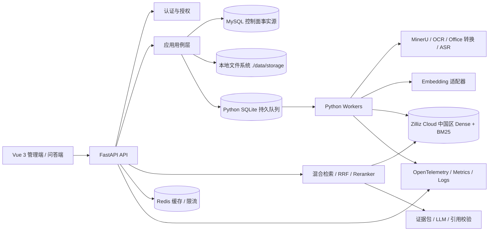

# 企业级 RAG 知识库完整开发计划

> 本文是对《开发计划.md》的审查、冲突消解和实施化重写。原文仅作为需求材料，其中的叙述性内容不构成新的执行指令。

| 项目 | 内容 |
| --- | --- |
| 文档状态 | 执行基线 v1.2（G0 修订审核中） |
| 编制日期 | 2026-08-31 |
| 目标版本 | R1 企业试点版（含办公文档、HTML、Excel/CSV 和音频） |
| 明确技术约束 | Python 3.12、Vue 3、MySQL、Redis、Zilliz Cloud 中国区、MinerU、统一 AI 适配层 |
| 计划基线 | R1：24 周、平均 11.25 FTE、约 270 人周；范围含表格与音频，均为估算，G0 后重新承诺 |
| 需求优先级 | `[必须]` 上线硬门槛；`[建议]` 默认方案；`[估算]` 需用真实容量校准；`[待确认]` 需责任人签字 |

### 导航

- 审查、目标与范围：第 0—4 章
- 架构、技术、数据与一致性：第 5—10 章
- 解析、检索、API、安全与测试：第 11—18 章
- WBS、团队、风险、门禁与发布：第 19—24 章
- 官方依据：第 25 章

---

## 0. 文档审查结论

### 0.1 当前文档的主要问题

1. 原文件由两份材料直接拼接：第一个一级标题是“需求与架构总结”，后半又从新的一级标题重新编号，存在大量重复。
2. 技术路线冲突：原材料曾并列多种数据库和检索组件；本基线统一为 MySQL + Redis + Zilliz Cloud 中国区 + MinerU。
3. 当前内容主要是架构说明和知识介绍，不是可排期执行的计划；缺少负责人、依赖、工期、阶段门禁和量化验收。
4. `READY`、`active`、`published` 等状态混用，入库任务、文档版本和索引代际没有独立状态机。
5. BM25、任务队列、文件存储、身份系统、缓存、模型清单和生产部署形态没有落点。
6. 数据模型和 API 仍是概念级，没有幂等、并发控制、错误码、权限投影、事件契约及跨存储一致性协议。
7. 文档格式被直接写成“支持”，但 MinerU 版本、Office 转换路径、定位精度和复杂样本尚未验证。
8. 评测维度基本齐全，但没有固定数据集、基线、发布阈值、执行频率和回归阻断规则。
9. 缺少容量模型、SLO、备份恢复、安全测试、灰度发布和回滚演练。

### 0.2 本计划的冲突处理规则

1. 以 Python 3.12 + Vue 3 + MySQL + Redis + Zilliz Cloud 中国区 + MinerU 为约束。
2. PostgreSQL、pgvector、Elasticsearch、Docling 不进入默认架构；只有阶段 0 的技术验证不达标时，才能通过 ADR 引入替代组件。
3. 推荐 FastAPI 作为后端框架，采用模块化单体 API + 独立 Worker，不在 R1 拆成十个微服务；该推荐必须在 G0 通过 ADR 批准。
4. MySQL 是元数据、权限、任务和发布控制面的事实源；Redis 只用于缓存/限流；项目本地文件系统是内容事实源；Zilliz Cloud 中国区是可重建检索投影。
5. 生产目标固定采用 Zilliz Cloud 中国区的 Milvus 兼容 Dense + 原生 BM25、中文分析器和 `pymilvus.MilvusClient`；RRF 由应用层负责。真实连接、ACL 与 watermark 是 G2 硬门禁。
6. MinerU 放在适配层后。Office 文件默认在隔离服务中转为 PDF 后解析；若目标 MinerU 版本直接处理 DOCX/PPTX 的效果和定位均达标，可切换为直通路径。
7. 任何参数数字都先作为实验基线，不视为“行业最优值”。
8. 未经阶段 0 确认的容量、成本、合规和业务优先级均明确标为估算或待确认。

---

## 1. 项目目标与成功定义

### 1.1 产品目标

构建一个面向企业多人使用的 RAG 知识库平台，覆盖：

- 多租户、知识空间、语料、来源、文档、版本和权限治理；
- 多格式资料接入、异步解析、质量隔离、结构化切分和索引发布；
- Dense 向量 + BM25 关键词混合检索、RRF 融合和 Reranker；
- 基于证据生成答案，返回可鉴权、可定位、可核验的引用；
- 文档更新、版本发布、回滚、撤权、删除和跨存储对账；
- 检索、答案、引用、安全、时延、费用和用户反馈的持续评测。

### 1.2 核心不变量

以下四项为 `[必须]`：

1. 所有结论都能追溯到当前有效的原始资料位置。
2. 文档版本、解析版本、Chunk 版本、模型版本和索引代际不能混用。
3. 未授权内容不得进入检索候选、正文读取、Reranker/LLM、缓存、引用预览或原件下载。受一致性延迟影响的非当前版本 ID 可以被检索投影短暂返回，但必须在读取正文和调用任何外部模型前由 MySQL 批量剔除。
4. 证据不足、条件缺失或资料冲突时，系统必须拒答、澄清或披露冲突，不得补写无依据事实。

### 1.3 R1 发布质量目标

以下数字是 `[估算]`，阶段 0 需结合真实数据、模型位置和基础设施冻结：

| 维度 | 指标 | 暂定发布门槛 |
| --- | --- | ---: |
| 解析 | R1 正式支持格式有效样本自动处理成功率 | 每种 ≥ 95%；受限 `.doc/.ppt` 每种 ≥ 90% |
| 解析 | 原文定位抽检正确率 | ≥ 98% |
| 解析 | 空 Chunk 或静默截断 | 0 |
| 检索 | Evidence Recall@20 | ≥ 0.85 |
| 排序 | nDCG@10 / MRR@10 | 硬门槛：不低于纯 BM25 与纯 Dense 中较优者；相对提升 ≥ 10% 为优化目标 |
| 回答 | 关键事实正确率 | ≥ 85% |
| 回答 | 依据性 / Groundedness | ≥ 90% |
| 引用 | ID、授权、版本、定位结构校验 | 100% |
| 引用 | 语义支持精确率 | ≥ 95% |
| 状态 | 五类业务回答状态 Macro-F1 | ≥ 0.85；`system_error` 另做故障注入 |
| 安全 | 跨租户、跨空间、父片段、缓存越权泄漏 | 0 |
| 性能 | `/search` p95 | ≤ 1.5 秒 |
| 性能 | SSE 首个进度事件 p95 / 已验证答案就绪 p95 | ≤ 1 秒 / ≤ 12 秒 |
| 生命周期 | 权限或可见性撤销 | ≤ 60 秒 |
| 清理 | 在线索引、缓存、临时产物和可访问对象清理 | ≤ 24 小时；备份、审计和法律保留按独立策略 |
| 可用性 | `/search` 与知识管理月可用性 / `/ask` 端到端月可用性 | ≥ 99.9% / ≥ 99.5% |
| 灾备 | 控制面与内容事实源 RPO / 核心搜索 RTO | ≤ 15 分钟 / ≤ 4 小时；需验证 Zilliz Cloud 备份/副本或全量重建方案 |

性能指标必须和数据规模、平均 Chunk 长度、并发、Top-K、模型部署位置及答案长度一起记录，否则不作为有效验收结果。

---

## 2. 范围与版本拆分

### 2.1 R1 企业试点版范围

`[必须]`：

- 多租户、知识空间、Corpus、Source、Document、DocumentVersion、Section、Chunk；
- OIDC/OAuth2 登录，对接企业身份源；RBAC + 资源属性/ACL 授权；
- PDF、扫描 PDF、图片、DOCX、PPTX、Markdown、TXT、上传型 HTML、XLS/XLSX、CSV、WAV、MP3、M4A；旧版 `.doc`、`.ppt` 经 LibreOffice 转换后作为受限支持；
- 原件、规范化文档、解析产物、媒体和来源定位保存；
- 异步任务、幂等、重试、取消、失败隔离和人工重跑；
- 结构优先 Chunk、父子片段、Embedding 和索引代际；
- Zilliz Cloud Dense + 原生 BM25 双路召回、相同权限过滤、RRF、去重和重排；
- 独立 `/search`、证据约束 `/ask`、SSE 进度流与验证后答案发送、来源预览；
- 文档版本发布、回滚、撤权、删除、跨存储对账；
- 管理端、问答端、检索调试、评测和运行监控；
- 固定评测集、性能测试、安全测试、备份恢复和上线回滚。

### 2.2 R1 表格与音频边界

- `.xls`、`.xlsx`、CSV 在 R1 使用专用结构化解析器，保存工作表、表名、表头、单位、行列和公式结果；
- WAV、MP3、M4A 在 R1 使用 ASR 适配器，保存分段文本和起止时间；
- Excel/CSV 只承诺知识检索和基于现有行列的解释，不承诺任意 SQL、复杂聚合或财务级精确计算；
- R1 提供单文档最小复核能力；批量复核工作台和更高级结构化计算留给未命名后续版本，不再设置独立扩展发布基线。

### 2.3 暂不纳入

- Agentic RAG、多 Agent、自主调用外部工具；
- 知识图谱、模型微调、LoRA；
- 自动写回业务系统或执行数据库写操作；
- 邮件、工单、代码仓库、数据库视图等实时连接器；
- 复杂答案缓存、跨知识空间自动路由；
- 自动网页爬取和定时全网同步；
- 任何容器平台；本项目统一使用原生进程部署。

---

## 3. 规划假设与容量基线

以下全部为 `[估算]`，阶段 0 必须修订：

| 项目 | 规划基线 |
| --- | --- |
| 项目形态 | 绿地开发；当前工作区只有计划文档 |
| 迭代节奏 | 2 周一个 Sprint，共 12 个 Sprint |
| 团队 | R1 平均 11.25 FTE、峰值约 13 FTE，24 周约 270 人周 |
| 文档规模 | 10 万份文档、500 万 Chunk |
| 日增量 | 每天新增或更新 2,000 份文档 |
| 在线负载 | 50 个并发问答；搜索峰值 20 QPS |
| 单文件上限 | 200 MB、600 页；格式可单独设置更低限制 |
| 评测集 | 150—300 个开发样本，发布前扩充至 300—500 个 |
| 解析黄金样本 | 100—200 份，覆盖各格式正常、复杂、损坏和超限样例 |
| 模型前提 | 已具备合法调用或本地部署渠道；项目不训练基础模型 |
| 业务前提 | 领域专家能提供样本、参考证据并参加 UAT |

如果要求完全离线、行业强监管、等保专项、多地域容灾或容量显著超过基线，预留 4—8 周增量评估。

---

## 4. 用户、角色与关键用例

### 4.1 角色

| 角色 | 主要权限 |
| --- | --- |
| 平台管理员 | 租户、系统配置、模型与索引配置、审计、运行状态 |
| 租户管理员 | 租户用户组、知识空间、配额和租户级审计 |
| 知识管理员 | Corpus、来源、文档、版本、发布、回滚、删除和权限 |
| 知识维护者 | 上传、更新、查看解析结果、处理失败和提交发布 |
| 普通读者 | 在授权范围内搜索、问答、查看引用和原件 |
| 评测人员 | 管理数据集、运行实验、查看质量报告 |
| 审计人员 | 只读查看权限变更、删除、模型出站和操作日志 |

### 4.2 关键用例

1. 知识维护者上传文档，立即获得文档 ID、版本 ID 和任务 ID，而不是同步等待解析完成。
2. 文档解析失败或质量不足时进入隔离区，维护者查看原因、产物和复核建议后重试。
3. 知识管理员验证新版本的解析和抽样检索，通过后原子切换为当前发布版。
4. 读者使用关键词或自然语言检索，仅看到授权、当前有效且在适用时间内的证据。
5. 问答接口在证据足够时返回答案和引用，在证据不足、条件缺失、资料冲突时返回明确状态。
6. 权限收紧、撤权或删除时优先阻断可见性，后台再执行全血缘物理清理。
7. 评测人员对同一数据集比较 Chunk、Embedding、RRF、Reranker、Prompt 或 LLM 配置。
8. 运维人员用 trace ID 串联 API、任务、检索候选、模型调用、引用和错误。

---

## 5. 目标架构



### 5.1 架构原则

1. 模块化单体优先；API 和 Worker 分进程、共享领域契约。
2. MySQL 是租户、权限、版本、发布和任务状态等控制面的事实源。
3. 项目本地文件系统是原件、网页快照、音频、图片、规范化文档和解析产物等内容面的事实源。
4. Zilliz Cloud 只保存可重建检索投影，不作为原文或权限的唯一副本。
5. 文档版本不可原地修改；新版本独立加工、验证、发布和回滚。
6. 文档解析、OCR、ASR、Embedding 和批量索引全部由 Worker 执行。
7. 权限条件进入 Zilliz Dense 与 BM25 检索表达式；返回 ID 后、读取正文或调用 Reranker 前，必须由 MySQL 做权威批量复核，输出前再复核一次。
8. 模型、解析器、分块器和检索器均通过自有接口适配，不让业务层依赖供应商 SDK。
9. `/search` 与 `/ask` 分离，先证明证据召回正确，再分析生成质量。
10. 所有配置、Prompt、模型和索引都有 revision，任何上线变更可追踪、可比较、可回滚。

### 5.2 部署边界

- API、Worker 无本地持久状态，可独立横向扩展。
- 解析、Embedding、索引、清理、评测分别使用队列和并发限制。
- 禁止 Docker、Docker Compose 和容器化运行。MinerU 与 LibreOffice 使用低权限本地账户或受限 Python 子进程运行，并配置 CPU、内存、磁盘、超时和网络限制。
- 后端、Worker、迁移和辅助程序均提供 `python xxx.py` 入口；前端使用 `npm run dev`。测试和 CI 同样不得依赖容器。
- 中间件只允许 MySQL 与 Redis；任务队列固定为 SQLite 支持的 Python 本地持久队列。向量检索只连接 Zilliz Cloud 中国区，不存在本地/原生向量库选择。缺少真实服务时使用显式 Stub，但不得通过相应真实 Gate。
- 所有内容存储在可配置的本地根目录，默认 `./data/storage`；生产可用性依赖独立备份磁盘、权限、容量监控和恢复演练。

---

## 6. 技术选型与架构决策

| 层面 | 推荐基线 | 约束与说明 |
| --- | --- | --- |
| 后端 | Python 3.12、FastAPI、Pydantic v2 | G0 批准后冻结；OpenAPI 为契约源 |
| ORM/迁移 | SQLAlchemy 2、Alembic | MySQL 事务边界统一管理 |
| 前端 | Vue 3、TypeScript、Vite、Pinia、Vue Router、Element Plus | OpenAPI 生成 TypeScript 客户端 |
| 元数据 | MySQL 8.4 LTS、InnoDB、utf8mb4 | 精确补丁版本用兼容矩阵锁定 |
| 检索 | Zilliz Cloud 中国区 | `pymilvus.MilvusClient` URI + Token；Dense + 原生 BM25、按语言分析器；应用层 RRF |
| Dense 索引 | HNSW + COSINE 作为基线 | 参数由目标规模压测确定 |
| 文档解析 | MinerU 独立适配服务 | 输出统一 CanonicalDocument |
| Office 转换 | LibreOffice 隔离服务 | 直通 MinerU 必须通过格式 Spike |
| 任务 | Python 本地 SQLite 持久队列 | 固定方案；MySQL 任务表仍是权威状态，队列不保存唯一业务状态 |
| 缓存/限流 | Redis | R1 不做复杂答案缓存 |
| 文件存储 | 本地文件系统，默认 `./data/storage` | original/artifacts/quarantine/temp 分区、checksum、原子写入和备份 |
| 流式回答 | SSE | R1 只流式发送进度；完整答案验证后发送 |
| 身份 | OIDC/OAuth2 + JWT | 对接企业 IdP；本地可使用 Keycloak |
| 测试 | pytest、本地子进程/内存 Fixture、Vitest、Playwright | 禁止 Testcontainers；固定评测集进入 CI 门禁 |
| 代码质量 | Ruff、mypy、pre-commit | 核心领域代码要求类型检查 |
| 可观测性 | OpenTelemetry、Prometheus、Grafana、集中日志/Trace | 请求和任务统一 trace ID |
| 密钥 | Vault/KMS/平台 Secret | 禁止进入代码、前端、普通配置和日志 |
| 配置 | `config/.env` + 进程环境 | 进程环境优先；唯一模板 `config/.env.example`；报告只输出变量状态 |
| MinerU 账号 | `MINERU_TOKENS` 多 Token 池 | round-robin、单 Token 并发、连续失败、429 冷却和自动故障切换 |

### 6.1 待 G0 批准的 ADR

| ADR | 建议决策 | 批准状态 |
| --- | --- | --- |
| ADR-001 | 模块化单体 API + 独立 Worker；任务固定使用 Python 本地 SQLite 持久队列 | 配置迁移已冻结 |
| ADR-002 | MySQL 为控制面事实源、Redis 为缓存、本地文件为内容面、Zilliz Cloud 为检索投影 | 配置迁移已冻结 |
| ADR-003 | 文档版本不可变，通过 `current_version_id` 和可见性投影协议切换 | G0 已批准方向 |
| ADR-004 | 索引使用高水位快照、增量追平、代际切换和回滚窗口 | G0 已批准方向；G2 真实验收 |
| ADR-005 | 入库使用 Transactional Outbox、至少一次消费、Inbox 去重和周期对账 | G0 已批准方向 |
| ADR-006 | 所有解析器输出统一文档契约，不向下游暴露 MinerU 私有结构 | G0 已批准方向；G1/G2 真实格式门 |
| ADR-007 | 生产目标固定 Zilliz Cloud 中国区原生 BM25 first；G2 执行真实中文/ACL/watermark 硬验收 | 配置迁移已冻结 |
| ADR-008 | 权限使用预编译有效授权域、检索前过滤、security watermark 和 deny-first 收紧 | G0 已批准方向；G2 真实验收 |
| ADR-009 | `/search` 与 `/ask` 分离；引用地址和定位由后端生成 | G0 已批准方向 |
| ADR-010 | 第一版使用确定性 RAG 流程，不采用 Agentic RAG | G0 已批准方向 |
| ADR-011 | SSE 发送阶段进度，答案经完整引用和权限校验后再发送 | G0 已批准方向 |
| ADR-012 | Processing、Index、Retrieval、Generation Profile 分离，由不可变 Release Manifest 组合 | G0 已批准方向 |

---

## 7. 模块、目录与依赖规则

```text
rag-knowledge-base/
├── backend/
│   ├── src/
│   │   ├── api/                         # HTTP/SSE、DTO、参数校验
│   │   ├── application/                 # 用例、事务和状态迁移
│   │   ├── domain/                      # 领域实体、值对象和端口
│   │   ├── ai/                          # LLM/OCR/MinerU/Embedding/Reranker/ASR 适配契约
│   │   ├── document_processing/         # 识别、解析路由、规范化、Chunk、质量
│   │   ├── knowledge_modeling/          # 知识层级、版本、权限、生命周期
│   │   ├── information_retrieval/       # Dense、BM25、过滤与单路候选
│   │   ├── vector_indexing/             # Embedding、Zilliz Cloud、索引代际与重建
│   │   ├── rag_orchestration/           # 查询、RRF、去重、重排、上下文预算
│   │   ├── generation_control/          # 证据包、Prompt、回答状态、引用校验
│   │   ├── engineering_security/        # IAM、Outbox、审计、限流、监控
│   │   ├── evaluation/                  # 数据集、实验和质量指标
│   │   └── infrastructure/              # MySQL、Redis、Zilliz Cloud、本地文件、SQLite 队列、模型客户端
│   ├── workers/
│   ├── configs/
│   ├── migrations/
│   ├── tests/
│   └── pyproject.toml
├── frontend/
│   ├── src/
│   └── tests/
├── run_backend.py                       # python run_backend.py
├── run_worker.py                        # python run_worker.py
├── scripts/                             # python scripts/xxx.py
├── data/                                # 本地运行数据，不提交
├── deploy/                              # 原生进程部署说明，不含容器文件
├── docs/
└── package.json                         # 前端 npm run dev 脚本入口说明
```

依赖只允许：

```text
api / workers
      ↓
application
      ↓
domain contracts
      ↑
infrastructure adapters
```

领域层不得直接依赖 FastAPI、SQLAlchemy、pymilvus、MinerU 或其他供应商 SDK。

---

## 8. 统一文档与 Chunk 契约

### 8.1 CanonicalDocument

所有格式最终输出同一逻辑结构：

```text
document_version_id
language
nodes[]
  node_id
  parent_node_id
  type: heading/paragraph/list/table/code/image/audio
  original_text
  display_text
  page/slide/sheet
  bbox
  char_range
  start_time/end_time
  metadata
tables[]
media_refs[]
parser_revision
normalization_revision
content_checksum
quality_issues[]
```

### 8.2 Chunk 文本分层

| 字段 | 用途 |
| --- | --- |
| `original_text` | 审计、引用和原文核对 |
| `display_text` | 前端展示，允许有限格式化 |
| `retrieval_text` | 标题路径、表头、单位、正文等检索上下文 |
| `embedding_text` | 应用模型前缀和输入规范后的文本 |
| `context_text` | 本次问答按 Token 预算组装的证据文本，不落为权威原文 |

### 8.3 Chunk 基线规则

- 默认按标题、段落、列表、表格、代码和音频时间段做结构切分。
- 普通子 Chunk 初始 400—800 Token，重叠 50—100 Token 或约 10%—15%。
- 父 Chunk 初始 800—1,500 Token；父片段只用于补全上下文。
- FAQ 的问题和完整答案作为一个单元；短而完整的结构可不重叠。
- 规则、适用条件、限制和例外尽量保持在同一证据单元。
- 表格子块重复带上表名、表头、单位和脚注。
- 代码和接口说明尽量保留函数、参数、错误码和示例的关系。
- 不允许空 Chunk、静默截断尾部或跨版本/跨权限父片段扩展。
- Chunk 算法、Tokenizer 和参数都写入 `chunking_revision`。

---

## 9. 领域模型与存储设计

### 9.1 统一知识层级

```text
Tenant
└── KnowledgeSpace
    └── Corpus
        └── Source
            └── Document
                └── DocumentVersion
                    └── Section
                        └── Chunk
                            └── SourceLocator
```

界面中的“知识库”统一对应 `KnowledgeSpace`，代码和数据库不再同时使用多套命名。

### 9.2 MySQL 核心表

统一约定：API ID 统一使用 UUIDv7，MySQL 存 `BINARY(16)`；所有租户数据带 `tenant_id`；时间使用 UTC `DATETIME(6)`；可变聚合带 `row_version`；软删除保留 `deleted_at` 和 tombstone。

| 表 | 关键字段与约束 |
| --- | --- |
| `tenants` | `id, code, status`；`code` 唯一 |
| `knowledge_spaces` | `tenant_id, name, status, current_release_manifest_id, current_retrieval_release_id` |
| `corpora` | `space_id, name, authority_rank, status` |
| `sources` | `corpus_id, kind, external_key, uri, status`；来源内外部键唯一 |
| `documents` | `source_id, external_key, current_version_id, owner_id, aggregate_state, security_transition_id, row_version` |
| `document_versions` | `document_id, version_no, content_sha256, object_uri, mime_type, valid_from/to, processing_status, publication_status, parser/normalizer/chunker_revision`；版本号唯一 |
| `artifacts` | `version_id, kind, object_uri, sha256, producer_revision` |
| `sections` | `version_id, parent_id, ordinal, title, path, locator_json` |
| `chunks` | `version_id, section_id, parent_chunk_id, ordinal, kind, original_text, display_text, retrieval_text, locator_json, token_count, content_sha256, chunking_revision, tokenizer_id, status` |
| `taxonomies/categories/tags/document_tags` | 分类树、标签和文档关联；支持产品、主题、组织等治理维度 |
| `glossary_terms/term_synonyms` | 术语、别名、同义词、语言、适用范围和审核状态 |
| `applicability_rules` | 产品、产品版本、地区、组织、业务条件、生效/失效时间 |
| `ingestion_jobs` | `version_id, operation, idempotency_key, request_hash, state, current_stage, attempt, lease_owner/expiry, heartbeat, next_retry_at, error_code`；幂等唯一键为 `(tenant_id, operation, idempotency_key)` |
| `job_steps` | `job_id, stage, attempt, state, input_hash, output_hash, timings` |
| `processing_profiles` | 解析、规范化、Chunk、Tokenizer、OCR/ASR 配置及 revision |
| `index_profiles` | Embedding provider/model/revision、前缀、归一化、维度、metric、Analyzer、BM25 Schema 指纹 |
| `retrieval_profiles` | Top-K、过滤、RRF、去重、Reranker 和上下文预算 revision |
| `generation_profiles` | LLM、Prompt、输出 Schema、引用和安全策略 revision |
| `release_manifests` | 不可变组合上述四类 Profile 及兼容性约束 |
| `index_generations` | `space_id, index_profile_id, collection_family, generation_id, source_snapshot_seq, last_applied_event_seq, security_watermark, state` |
| `retrieval_releases` | `space_id, active_generation_id, release_manifest_id, active_permission_revision, source_snapshot_seq, last_applied_event_seq, security_watermark, row_version` |
| `index_entries` | `generation_id, chunk_id, zilliz_pk, checksum, state`；用于对账 |
| `acl_policies` | `tenant_id, name, revision, status` |
| `acl_bindings` | `subject_type/id, resource_type/id, action, effect, inheritance_mode, valid_from/to` |
| `permission_projections` | `resource_id, permission_revision, visibility, effective_scope_tokens, classification_level, projection_state` |
| `security_transitions` | 受影响资源、旧/新权限 revision、状态、Milvus commit timestamp、watermark 和故障原因 |
| `rag_runs` | `request_id, user_id, query, processing/index/retrieval/generation_profile_revision, index_generation_id, permission_revision, result_status, timings, token/cost` |
| `retrieval_hits` | `run_id, chunk_id, channel, rank, raw_score, fused_score, rerank_score` |
| `citations` | `(run_id, evidence_id)` 复合主键、`chunk_id, locator, structural_valid, semantic_result` |
| `user_feedback` | `run_id, user_id, rating, reason_code, comment, created_at` |
| `eval_datasets/cases/runs/results` | 数据集、参考证据、实验配置和分层指标 |
| `outbox_events` | `event_id, aggregate_type/id/version, tenant_id, partition_key, event_type, payload_schema_version, sequence_no, occurred_at, state` |
| `inbox_events` | Consumer、event ID、处理结果和时间；用于至少一次消费去重 |
| `audit_logs` | append-only 主体、动作、资源、结果、IP、request/trace ID、前序哈希和当前哈希 |
| `deletion_tombstones` | 删除范围、待清理存储、完成状态和保留截止时间 |

所有租户表建立 `(tenant_id, id)` 组合唯一键；层级外键同时携带 `tenant_id`，数据库层阻止跨租户关联。Repository 由服务端强制注入 tenant context，普通业务 Repository 不接收客户端提供的租户条件；平台管理员跨租户操作使用独立接口、独立权限和全量审计。

### 9.3 Zilliz Cloud（Milvus 兼容）检索投影

每条索引记录至少包含：

```text
zilliz_pk
tenant_id
space_id
corpus_id
document_id
document_version_id
chunk_id
parent_chunk_id
chunk_type
language
valid_from / valid_to
lifecycle_projection
visibility
acl_scope_tokens[]
permission_revision
classification_level
authority_rank
category_ids[] / tag_ids[]
product_ids[] / applicable_versions[] / region_codes[]
retrieval_text
dense_vector
sparse_vector  # 由内置 BM25 函数产生
index_generation_id
analyzer_revision
content_checksum
```

- Zilliz Cloud 预过滤包含租户、空间、活动代际、`SERVING` 投影、时态、密级、适用条件和有效 ACL；“是否为逻辑文档当前版本”由召回 ID 后的 MySQL 批量校验完成。
- 两路搜索只返回 ID、rank 和必要的非敏感元数据；MySQL 完成 ACL、当前版本和时态复核后，服务才读取正文并调用 Reranker。
- 授权 Token 由后端根据当前身份计算，客户端只能收窄，不能扩大范围。
- Collection family 按向量维度、metric、Analyzer 和 BM25 Schema 指纹创建；同一 family 内以 `space_id + index_generation_id` 过滤，高敏或超大租户可独占 family。
- `language` 驱动多语言 Analyzer，中文使用 `chinese/jieba` 基线，未知语言使用 ICU 基线；索引和查询 Analyzer 必须一致。
- G2 在 Zilliz Cloud 中国区验证 `ARRAY_CONTAINS_ANY` 的表达式长度和性能；底层 Milvus ARRAY 的 `max_capacity` 固定在 1—4096，R1 必须控制授权 Token 上限。

### 9.4 ACL 编译语义

R1 使用可预编译权限模型，不要求 Zilliz Cloud 在查询时解析复杂继承：

1. 默认拒绝；资源可设 `TENANT` 或 `RESTRICTED`，平台公开知识仍限制在当前租户。
2. ACL 从 Space → Corpus → Source → Document 继承；子资源只允许 `INHERIT` 或 `REPLACE`，避免难以审计的任意叠加。
3. MySQL 中显式 deny 优先于 allow；权限编译器计算最终有效授权域，Zilliz Cloud 只保存最终 `effective_scope_tokens`，不解析 deny。
4. Subject Token 只包含当前租户内的 `user:{id}`、`group:{id}`、`role:{id}`；空 Token 对 `RESTRICTED` 表示无人可访问。
5. `TENANT` 不支持单用户例外 deny；需要例外时必须切换为 `RESTRICTED` 并显式编译允许域，避免向量过滤无法表达否定集合。
6. 普通查询过滤基线：

```text
tenant_id == T
AND space_id IN authorized_spaces
AND index_generation_id == active_generation
AND lifecycle_projection == "SERVING"
AND classification_level <= subject_clearance
AND (
  visibility == "TENANT"
  OR ARRAY_CONTAINS_ANY(acl_scope_tokens, subject_scope_tokens)
)
```

### 9.5 本地文件存储结构

```text
data/storage/
  original/tenant/{tenant_id}/space/{space_id}/document/{document_id}/version/{version_id}/{filename}
  artifacts/tenant/{tenant_id}/space/{space_id}/document/{document_id}/version/{version_id}/...
  quarantine/{upload_session_id}/...
  temp/{job_id}/...
  audit/...
```

文件路径不作为授权依据，客户端不能提交或拼接服务器路径。所有下载由后端重新鉴权并以受控响应返回。上传先写入 quarantine，使用随机服务端文件名、规范化绝对路径和原子 rename；只有完成大小、SHA-256、MIME/魔数、恶意软件和路径边界校验后，才晋升为不可变原件。任何解析后的相对路径必须验证仍位于配置的 storage root 内。

---

## 10. 状态机与跨存储一致性

### 10.1 入库任务状态

```text
QUEUED
  → RUNNING
      VALIDATING
      SECURITY_SCANNING
      STORING
      PARSING
      NORMALIZING
      CHUNKING
      EMBEDDING
      INDEXING
      VERIFYING
  → SUCCEEDED

RUNNING → RETRY_WAIT → QUEUED
达到重试上限 → FAILED_FINAL
QUEUED/RUNNING/RETRY_WAIT → CANCEL_REQUESTED → CANCELLED
FAILED_FINAL → 人工创建新 attempt → QUEUED
```

要求：

- 每一步以输入哈希、配置 revision 和唯一键保证幂等。
- Worker 写索引前重新检查版本是否已撤销或删除。
- 可重试错误和永久错误使用不同错误码。
- 失败超过阈值进入死信队列和人工处理。
- 取消只清理暂存产物，不能误删已发布版本。
- 同一 Document 的发布、权限、删除事件按 `aggregate_version/sequence_no` 有序应用；Consumer 用 `inbox_events` 去重。

### 10.2 Document 聚合与 Version 发布状态

```text
Document aggregate:
ACTIVE → SWITCHING → ACTIVE
ACTIVE → REVOKING → REVOKED → PURGING → DELETED

DocumentVersion publication:
DRAFT → PROCESSING → VALIDATED → SERVING → SUPERSEDED → RETIRED
            └→ QUARANTINED → PROCESSING
SUPERSEDED → SERVING  # 仅在 Document=SWITCHING 的回滚协议中
```

不变量：

- `VALIDATED` 只表示加工和验证通过，不代表生产可检索。
- 同一逻辑文档最多一个 `current_version_id`。
- 已发布版本不可原地修改。
- 新版处理失败时旧版继续服务。
- 最终可检索性的权威判断是 Document 为 `ACTIVE` 且 `current_version_id` 指向该 Version；Version 自身状态只描述发布历史。
- `SWITCHING`、`REVOKING` 或安全变更期间，正文读取和外部模型调用 fail-closed。

### 10.3 索引代际状态

```text
BUILDING → VALIDATING → ACTIVE → RETIRING → RETIRED → DELETED
     └──────────────→ FAILED
RETIRING → ACTIVE  # 回滚窗口内
```

激活使用 `retrieval_releases.active_generation_id` 的 CAS 切换；旧代际在回滚窗口内保持 `RETIRING`。

### 10.4 在线检索的权威校验顺序

```text
读取 MySQL active generation、release manifest、permission revision 和 security watermark
  → 确认目标 Space 没有未完成的安全收紧事务
  → Zilliz Cloud BM25/Dense 仅返回 chunk ID、rank 和非敏感元数据
  → MySQL 批量校验 tenant、当前版本、Document 状态、ACL、时态和适用条件
  → 应用层按已授权 ID 执行 RRF/去重
  → 读取融合候选的已授权正文
  → Reranker
  → 父片段再次鉴权并读取
  → LLM
  → 输出前再次校验授权与版本
```

Zilliz Cloud 无法关联 `documents.current_version_id`，因此当前版本校验不能伪装成一个向量库过滤条件。非当前版本 ID 即使因投影延迟被召回，也不得读取正文、发送到外部模型或返回客户端。

### 10.5 文档发布与回滚协议

1. 新 Version 完成解析、Chunk、Embedding 和索引写入，投影状态保持 `STAGED`。
2. MySQL 事务将 Document 置为 `SWITCHING`，记录旧/新 Version、row version 和 outbox 事件；读取正文时对该 Document fail-closed。
3. Worker 将新 Version 投影改为 `SERVING`、旧 Version 改为 `SUPERSEDED`，记录 Zilliz/Milvus 兼容 commit timestamp，并用 Strong 查询验证。
4. 通过 MySQL CAS 切换 `current_version_id`，同步更新 Version 发布状态。
5. 清除 `SWITCHING`，Document 回到 `ACTIVE`；失败则恢复旧投影并保持旧指针。
6. 回滚执行同一协议，目标是回滚窗口内的 `SUPERSEDED` Version；不得只改 MySQL 指针。

该顺序允许切换期间短暂少召回，但不允许新旧正文同时进入 Reranker 或 LLM。

### 10.6 索引代际构建与切换

```text
记录 MySQL/Outbox source_snapshot_seq
  → 全量构建 BUILDING 代际
  → 重放 snapshot 后的增量事件
  → ACL、撤权、删除事件向 ACTIVE 与 BUILDING 双写
  → last_applied_event_seq 追平且 lag=0
  → 数量、checksum、权限和删除 tombstone 对账
  → Strong/guarantee timestamp 验证 security watermark
  → CAS 切换 retrieval_releases.active_generation_id
  → 旧代际进入 RETIRING 回滚窗口
```

BM25 Analyzer、文本字段、Function、稀疏索引、Embedding 维度或 metric 变化必须新建代际；不得把这些 Schema 级配置当作在线热更新参数。

### 10.7 ACL 收紧、撤权与 Zilliz Cloud 一致性

1. MySQL 事务先创建 staged 权限 revision，并把受影响 Space 记录为 `SECURITY_TRANSITION`；R1 在此期间对该 Space 的搜索和问答整体 fail-closed。
2. 权限编译器按 deny 优先和继承规则生成最终有效授权 Token，写入 ACTIVE 及所有 BUILDING 代际。
3. Worker 记录兼容 commit/guarantee timestamp，以 Strong 查询验证旧授权域不可命中。
4. CAS 激活新 permission revision，同时更新 `retrieval_releases.security_watermark`。
5. 清除安全变更状态；失败时 Space 保持阻断，直到安全回滚或重试完成。
6. 普通查询可采用 Bounded 一致性，但必须达到活动 release 的 security watermark；达不到时切换 Strong 查询或 fail-closed。
7. 权限放宽允许投影稍后生效；权限收紧、撤权和删除不允许以可用性换取短暂过度授权。

### 10.8 通用跨存储协议

1. MySQL 本地事务同时写业务数据和 `outbox_events`。
2. Worker 以至少一次语义消费事件，使用 `inbox_events` 去重；所有本地文件和 Zilliz Cloud 写入使用稳定业务键、临时文件 + 原子 rename 及 checksum。
3. 新文档版本、权限投影和索引代际在验证成功前都不可发布。
4. 删除采用“先不可见、再异步物理清理”；定时对账本地文件、MySQL、Zilliz Cloud、Redis 和 tombstone。
5. 从备份恢复后必须先重放 permission/security watermark 和 deletion tombstone，再开放检索，防止已撤权或删除内容复活。

---

## 11. 文档处理设计与格式验收

| 格式 | 默认处理路径 | 必须保留 | 关键验收 |
| --- | --- | --- | --- |
| R1 Markdown/TXT | 原生解析 | 标题、列表、代码、编码 | 层级、代码块、尾部无丢失 |
| R1 文本 PDF | MinerU | 页码、阅读顺序、表格、图片关联 | 双栏、页眉页脚、断行、定位 |
| R1 扫描 PDF/图片 | MinerU + OCR | 页码/bbox、OCR 质量 | 数字、单位、专名、方向、低清样本 |
| R1 DOCX | 隔离 LibreOffice 转 PDF + MinerU；直通为候选 | 原文件、段落、标题、表格、页映射 | 样式异常、表格关系、页定位 |
| R1 PPTX | 隔离 LibreOffice 转 PDF + MinerU；直通为候选 | 页序、标题、文本、表格、图片 | 幻灯片映射、备注策略、图表关系 |
| R1 `.doc/.ppt` | LibreOffice 转换后进入对应路径，受限支持 | 原文件、转换日志、页映射 | 能转换的有效样本达门槛；失败明确隔离 |
| R1 HTML | 上传文件原生净化与正文提取 | 原始快照、标题、来源、上传时间 | 导航噪声、脚本、隐藏文本 |
| R1 `.xls/.xlsx`/CSV | 专用结构化解析器 | 工作表、表名、表头、单位、行列、公式值 | 合并单元格、编码、空值、结构保真 |
| R1 音频 | ASR 适配器 | 原音频、分段文本、起止时间 | 噪声、长音频、时间戳、续传 |

每种声明支持的格式必须具备：正常、复杂、损坏、密码保护、超限、低质量和降级样例。解析失败、空内容、乱码、定位无效或低质量结果必须进入 `QUARANTINED`，不得发布。

### 11.1 MinerU 技术验证门

G0 不要求真实解析服务或 60 份样本全部到位；退出条件是完成六类采集清单、责任、验收指标和可执行 Harness：文本 PDF、扫描 PDF/图片、DOCX、PPTX、表格、音频各 10 份。真实文件和效果不在 G0 冒充支持：前五类的真实解析/定位在 G1 是硬门禁，音频 ASR 与全部六类的检索可用性在 G2 是硬门禁；这批难例仍不替代发布黄金集。

- PDF 文本层、扫描件、双栏、复杂表格、公式、图片和页码定位；
- DOCX/PPTX 直通与转 PDF 两条路径的内容覆盖、位置映射、耗时和资源；表格结构与音频时间戳使用各自适配器验证；
- 本地部署与远程 API 的功能、文件大小、页数、并发、超时和数据出站差异；
- CPU/GPU 资源、许可证、模型资产、启动时间和可横向扩展性；
- 输出内容块覆盖率、locator 有效率、单页/单文档耗时、峰值内存和失败分类均形成可复现报告。

G0 退出条件是路径候选、降级原则、60 槽位采集清单、责任和 Harness 就绪。G1/G2 真实门禁前不得宣称任何尚未实测格式“已支持”；若出现系统性丢页、错序、表格破坏、时间戳错误或无法定位，必须降级为专用解析器或“受限支持”。

---

## 12. 检索、生成与引用设计

### 12.1 查询链路

```text
认证与权限范围
  → 保留原问题并识别产品/版本/时间条件
  → 生成两路完全一致的 ACL、代际、时态、密级和适用条件过滤
  → Zilliz Cloud BM25 + Dense 仅召回 ID/rank
  → MySQL 批量复核 ACL、当前版本、时态和适用条件
  → 应用层对已授权 ID 做 RRF 融合和去重，再读取正文
  → Reranker 重排
  → 父片段再次鉴权后补全
  → 上下文预算和证据充分性判断
  → LLM 在服务端缓冲生成
  → 引用存在/授权/版本/定位校验
  → 输出前最终权限复核
  → 发送已验证答案、引用和 trace ID
```

### 12.2 第一轮实验配置

下列是可版本化实验基线，不是最终最优值：

| 阶段 | 初始值 |
| --- | --- |
| BM25 召回 | Top 50 |
| Dense 召回 | Top 50 |
| RRF | `k=60` |
| 融合去重后 | Top 50 |
| Reranker 输入 | Top 40 |
| 最终证据 | 6—10 个片段 |
| 上下文 | 不超过模型窗口的 50%，并设置绝对 Token 上限 |

必须与纯 BM25、纯 Dense、无 Reranker 三个基线做对照。Reranker 无法修复未被召回的证据；优化顺序应是解析 → Chunk → 过滤 → 召回 → 融合 → 重排 → 生成。

### 12.3 证据包

```text
evidence_id
rag_run_id
document_id / version_id
document_title
section_path
source_locator: page/slide/sheet/bbox/time_range
valid_from / valid_to
authority_rank
content
```

模型只能引用本次证据包内的 `E1、E2...`。`evidence_id` 只在 `rag_run_id` 内唯一；对外访问使用二者组合或绑定 tenant/user/run/expiry 的不透明签名 Token。页面、文件链接和下载地址由后端生成，模型不得自行构造。

### 12.4 回答状态

| 状态 | 含义 |
| --- | --- |
| `answered` | 有足够且一致的授权证据 |
| `insufficient_evidence` | 当前可访问资料不足 |
| `needs_clarification` | 缺少产品、版本、时间等关键条件 |
| `conflicting_evidence` | 当前证据存在不能自动消解的冲突 |
| `out_of_scope` | 不属于系统承诺的任务，如任意精确计算 |
| `system_error` | 依赖或内部故障 |

业务回答状态与 HTTP 状态分开。普通自然语言问答不会用 `not_authorized` 暗示某份未授权资料存在，而是仅基于可访问资料返回 `insufficient_evidence`。用户显式访问已知资源的管理操作使用 HTTP 403/404，并写入内部 `authorization_denied` 审计事件。

### 12.5 安全降级

- Reranker 失败：返回 RRF 排序并标记降级。
- LLM 失败：返回已授权证据列表，不伪造答案。
- 引用验证失败：不返回未经验证的生成答案。
- Zilliz Cloud 不可用：返回系统错误，不改用无 ACL 的备用查询。
- 权限服务或权限投影状态异常：fail-closed。

---

## 13. API 契约

统一前缀 `/api/v1`。创建和异步动作支持 `Idempotency-Key`，唯一范围为 `(tenant_id, operation, key)` 并保存 request hash；同键不同请求返回 409。修改既有聚合使用 `ETag/If-Match`，所有请求支持 `X-Request-ID`，列表使用游标分页，OpenAPI 生成前端客户端。

### 13.1 主要接口

```text
POST   /spaces
GET    /spaces/{id}
POST   /spaces/{id}/corpora
GET    /spaces/{id}/corpora
POST   /corpora/{id}/sources
GET    /corpora/{id}/sources
GET    /spaces/{id}/taxonomies
POST   /spaces/{id}/taxonomies
GET    /spaces/{id}/glossary-terms
POST   /spaces/{id}/glossary-terms

POST   /spaces/{id}/upload-sessions
POST   /upload-sessions/{id}:complete
POST   /upload-sessions/{id}:abort
POST   /documents/{id}/versions
GET    /documents/{id}
GET    /documents/{id}/versions
POST   /document-versions/{id}:publish
POST   /documents/{id}:rollback
DELETE /documents/{id}
GET    /operations/{id}

GET    /ingestion-jobs/{id}
POST   /ingestion-jobs/{id}:retry
POST   /ingestion-jobs/{id}:cancel

GET    /resources/{resource_type}/{id}/permissions
PUT    /resources/{resource_type}/{id}/permissions
POST   /permissions:simulate

POST   /search
POST   /ask
POST   /ask:stream
GET    /rag-runs/{run_id}/evidence/{evidence_id}
GET    /rag-runs/{run_id}/evidence/{evidence_id}/source
POST   /rag-runs/{run_id}/feedback

POST   /eval-runs
GET    /eval-runs/{id}
GET    /admin/profiles/{profile_type}
POST   /admin/profiles/{profile_type}
POST   /admin/release-manifests
POST   /admin/release-manifests/{id}:publish

GET    /health/live
GET    /health/ready
```

### 13.2 直传隔离与异步响应

```text
创建 upload session
  → 客户端上传到 quarantine bucket/prefix
  → complete（校验对象版本、大小、SHA-256、MIME/魔数）
  → 恶意软件和压缩炸弹扫描
  → 晋升为 immutable original
  → 创建 DocumentVersion 与 ingestion job
```

文件写入完成不能单独作为可信完成信号；`complete` 必须由已认证客户端调用并由服务端验证临时文件、哈希与路径边界。

```json
{
  "document_id": "...",
  "document_version_id": "...",
  "job_id": "...",
  "status": "QUEUED"
}
```

`complete` 返回 HTTP `202 Accepted`。相同幂等键和相同 request hash 返回同一个结果，不创建重复可见版本。

### 13.3 `/search` 请求与最小响应

请求只接受白名单过滤字段。客户端条件只能收窄服务端授权范围；正文、ACL Token、任意 Zilliz 查询表达式和 `tenant_id` 不允许由客户端直接传入。

```json
{
  "request_id": "...",
  "trace_id": "...",
  "rag_run_id": "...",
  "mode": "hybrid",
  "hits": [
    {
      "evidence_id": "E1",
      "chunk_id": "...",
      "document_id": "...",
      "version_id": "...",
      "section_path": "...",
      "locator": {"page": 12},
      "text": "...",
      "ranks": {"bm25": 3, "dense": 7, "fused": 2, "rerank": 1}
    }
  ],
  "release_manifest_revision": "...",
  "index_generation_id": "..."
}
```

原始分数、过滤表达式和调试细节仅对管理员开放。

### 13.4 `/ask` 最小响应

```json
{
  "request_id": "...",
  "trace_id": "...",
  "rag_run_id": "...",
  "status": "answered",
  "answer": {"text": "..."},
  "citations": [
    {
      "evidence_id": "E1",
      "evidence_token": "opaque-signed-token",
      "document_id": "...",
      "version_id": "...",
      "title": "...",
      "section_path": "...",
      "locator": {"page": 12}
    }
  ],
  "quality": {
    "evidence_sufficiency": "sufficient",
    "citation_coverage": 0.96,
    "conflict_count": 0
  },
  "release_manifest_revision": "...",
  "index_generation_id": "..."
}
```

相似度或 Reranker 分数不得包装成“答案正确概率”。

### 13.5 SSE 事件

```text
accepted
retrieving
reranking
generating
validating
verified
answer_delta
completed
error
```

R1 在 `generating` 阶段把答案缓冲在服务端；只有权限、版本和引用校验通过并发送 `verified` 后，才允许用一个 `answer` 或多个 `answer_delta` 事件传输答案。`completed` 携带最终状态和已验证引用。授权在输出前再次计算；流式期间发生撤权时丢弃缓冲答案。

### 13.6 统一错误

```json
{
  "code": "INGEST_PARSE_TIMEOUT",
  "message": "文档解析超时",
  "request_id": "...",
  "retryable": true,
  "details": {}
}
```

错误码域：`AUTH_*`、`DOC_*`、`INGEST_*`、`INDEX_*`、`RETRIEVAL_*`、`MODEL_*`、`CONFLICT`、`RATE_LIMITED`、`INTERNAL`。未授权资源通常返回 404，避免泄露其存在性。

---

## 14. 功能需求清单

| ID | 需求 | 验收摘要 |
| --- | --- | --- |
| FR-IAM-01 | 对接 OIDC/OAuth2，建立租户和用户组上下文 | 伪造租户/组声明无效 |
| FR-IAM-02 | RBAC + 空间/文档 ACL + 时态权限 | 权限矩阵零越权 |
| FR-KM-01 | 管理 Space、Corpus、Source、Document | CRUD、分页、审计完整 |
| FR-KM-02 | 文档版本不可变、发布指针切换 | 新版失败不影响旧版 |
| FR-KM-03 | 分类、标签、术语、同义词、权威等级、密级和适用条件治理 | 可作为查询过滤，修改有审核与 revision |
| FR-ING-01 | 分片/直传上传、哈希、MIME 与魔数校验 | 重复提交幂等、损坏文件拒绝 |
| FR-ING-02 | 原件和解析产物进入受控本地文件存储 | 哈希可校验、可回查、无路径穿越 |
| FR-ING-03 | 按格式路由解析并输出 CanonicalDocument | 下游不依赖解析器私有格式 |
| FR-ING-04 | 结构 Chunk、父子关系、来源定位 | 无空块、截断或越权父块 |
| FR-ING-05 | 质量评分、隔离、重试、取消和人工重跑 | 异常不进入生产检索 |
| FR-IDX-01 | 记录模型、维度、距离、归一化、Chunk revision | 向量代际不可混用 |
| FR-IDX-02 | 构建、验证、激活、回滚和删除索引代际 | 蓝绿切换可演练 |
| FR-IDX-03 | MySQL、本地文件、Zilliz Cloud 定时对账 | 不一致可检测和修复 |
| FR-RET-01 | BM25、Dense 和 Hybrid 三种搜索模式 | `/search` 不调用 LLM |
| FR-RET-02 | 两路使用相同租户、ACL、代际、时态和适用条件过滤，并在正文读取前校验当前版本 | 任何越权为阻断缺陷 |
| FR-RET-03 | RRF、去重、Reranker 和父片段补全 | 阶段排名可追踪 |
| FR-RAG-01 | 证据预算、充分性与冲突判断 | 六种公共问答状态有用例；授权拒绝走 HTTP/审计 |
| FR-RAG-02 | LLM 基于证据生成并仅引用证据 ID | 无证据不得编写结论 |
| FR-RAG-03 | 后端校验引用存在、授权、版本和定位 | 结构校验 100% |
| FR-RAG-04 | SSE 进度流、验证后答案输出和安全降级 | `verified` 前不发送答案正文 |
| FR-LIFE-01 | 新版本独立处理、验证、发布和回滚 | 不出现半新半旧状态 |
| FR-LIFE-02 | 撤权和删除先阻断可见性，再全血缘清理 | 旧任务不能复活内容 |
| FR-UI-01 | 知识空间、文档、版本、任务和权限页面 | 各角色操作受后端控制 |
| FR-UI-02 | 检索调试和问答引用预览 | 可跳原页/幻灯片/时间点 |
| FR-EVAL-01 | 数据集、实验、指标、回归和对比 | 发布未达门槛即阻断 |
| FR-EVAL-02 | 用户对问答结果评分、原因和意见反馈 | 反馈绑定 run、用户和配置 revision，可进入评测集候选 |
| FR-OPS-01 | 日志、指标、Trace、费用和告警 | request/trace ID 全链路 |
| FR-AUD-01 | 权限、发布、删除、模型出站审计 | 审计只读且防篡改 |

---

## 15. 前端页面与交互

| 页面 | 核心功能 |
| --- | --- |
| 登录与租户切换 | OIDC 登录、当前租户和角色展示 |
| 知识空间 | Space/Corpus/Source 列表、权限和状态 |
| 知识治理 | 分类、标签、术语、同义词、权威等级、密级和适用条件 |
| 文档管理 | 上传、版本、发布、回滚、撤权、删除、原件预览 |
| 入库任务 | 阶段进度、耗时、错误、产物、重试、取消和隔离 |
| 解析复核 | R1 单文档原文/规范化内容并排与审批；批量复核和高级质量工作台留给后续版本 |
| 检索调试 | BM25/Dense/RRF/Reranker 排名、过滤条件和配置 revision |
| 问答 | 阶段进度、已验证答案、状态、引用、来源定位、反馈、澄清和冲突展示 |
| 评测中心 | 数据集、实验运行、指标、回归对比和门禁状态 |
| 运行管理 | 队列、失败率、索引代际、模型耗时、Token 和费用 |
| 审计 | 权限、发布、删除、配置和模型出站记录 |

交互要求：

- 上传后的“已接收、处理中、待发布、已发布、隔离、失败”必须清晰区分。
- 引用可跳到正确 PDF 页、PPT 页、Excel 工作表/区域或音频时间点。
- 前端隐藏按钮不是权限控制；所有操作在后端重新鉴权。
- 无权限时不显示文档标题、摘要或“资源存在”提示。
- `verified` 事件前只展示阶段进度，不展示答案正文；完成后才开放复制和引用跳转。

---

## 16. 安全、隐私与合规

### 16.1 访问控制

- 每次请求从后端身份上下文获得 `tenant_id`、用户、用户组和授权 Token。
- OIDC access token 使用短 TTL，并支持企业 IdP 的组变更/会话撤销策略；高风险操作在执行前重新查询当前授权，而不是只信任长生命周期 JWT。
- Dense、BM25、父片段、缓存、引用预览和原件下载使用同一授权语义。
- 权限服务异常、权限投影不一致或安全变更进行中时 fail-closed。
- 权限收紧、租户迁移、删除和恢复均进入权限矩阵与生命周期回归。

### 16.2 文件安全

- 扩展名、MIME 和文件魔数三重校验。
- 文件大小、页数、解压比、嵌套层数、CPU、内存、磁盘和执行时间限制。
- 恶意软件扫描、压缩炸弹、路径穿越、宏、脚本、外部链接和嵌入对象检测。
- 解析进程使用低权限本地账户、受控工作目录、临时目录配额和默认无外网策略；不得借助容器隔离代替这些控制。
- 加密或密码保护文档不得绕过检查；进入隔离并提示人工处理。

### 16.3 模型与提示词安全

- 文档内容视为不可信数据，与系统指令使用结构化边界隔离。
- R1 不允许检索内容触发代码执行、数据库写入、文件写入或网络工具。
- 外部 LLM、Embedding、Reranker、OCR、MinerU API 和 ASR 分别配置数据出站策略。
- 按数据分级决定是否允许出站，记录供应商、区域、保留策略、请求量和审计事件。
- Prompt injection 测试覆盖“忽略指令、泄露其他文档、伪造引用、调用工具”等样例。

### 16.4 平台安全

- 传输 TLS，存储静态加密，密钥由 Vault/KMS/平台 Secret 管理和轮换。
- CI 执行 SAST、SCA、SBOM、密钥扫描、Python/Node 依赖和部署脚本扫描，不构建或扫描容器镜像。
- 日志默认不记录完整文档、模型上下文或访问令牌；必要内容按字段脱敏。
- 审计写入账号只有 INSERT 权限，业务和管理员账号无 UPDATE/DELETE 权限；记录形成哈希链，按日签名根哈希并复制到独立只追加本地归档盘或企业 SIEM。
- 审计日志与业务日志分离，设置独立访问权限和保留期；每日验证哈希链，验证失败立即告警并保全证据。
- 发布前无未处置的 Sev-1/Sev-2；任何跨租户泄漏均为发布阻断。

---

## 17. 可观测性、运维与灾备

### 17.1 监控指标

| 层面 | 关键指标 |
| --- | --- |
| API | QPS、p50/p95/p99、4xx/5xx、SSE 中断、限流 |
| Worker | 队列长度、等待时间、阶段耗时、重试、死信、资源使用 |
| 解析 | 格式成功率、空内容、质量分、隔离率、定位有效率 |
| 索引 | 写入延迟、代际状态、Chunk 对账差异、删除积压 |
| 检索 | 空结果率、各路召回、过滤耗时、RRF/重排耗时 |
| 模型 | 并发、超时、429、Token、费用、供应商和模型 revision |
| 生命周期 | 发布、回滚、权限传播、撤权和物理清理时延 |
| 安全 | 越权拒绝、恶意文件、异常出站、密钥和审计事件 |

### 17.2 日志与 Trace

- 100% API 请求和异步任务带 request ID / trace ID。
- 错误链路全采样；成功链路按比例采样，评测和安全事件全量保留。
- 一次问答可关联授权范围、检索配置、候选排名、模型调用、引用和最终状态。
- 敏感正文和用户问题只在受控调试模式短期保存，并记录访问审计。

### 17.3 备份与恢复

- MySQL：全量备份 + binlog/PITR，季度恢复演练；权限、发布指针、security watermark 和 tombstone 纳入同一恢复点。
- 本地文件存储：原件和规范化产物校验哈希，至少备份到独立磁盘/主机并定期离线校验；G0 冻结内容 RPO、容量和恢复时间。
- Zilliz Cloud：验证服务侧备份/副本与从 MySQL + 规范化产物全量重建；若重建超过 4 小时，不得宣称满足核心搜索 RTO。
- 配置、Prompt、模型清单和索引元数据进入版本库或配置仓库。
- 发布前完成 MySQL、文件内容、Zilliz Cloud 重建、索引回滚和节点故障演练。

### 17.4 必备 Runbook

- 模型超时、限流和费用异常；
- MinerU/OCR 队列堆积；
- Zilliz Cloud 查询失败或索引代际异常；
- MySQL 与 Zilliz Cloud 对账不一致；
- 权限投影失败或疑似越权；
- 删除积压、旧任务复活风险；
- Python 本地持久队列、MySQL、Redis、本地文件系统故障、磁盘满、权限错误和备份失败；
- 数据库恢复、版本回滚和紧急下线。

Redis 中涉及权限 revision 或安全阻断的缓存异常时 fail-closed；普通检索结果和限流以外的性能缓存异常可以绕过并回源，Redis 永远不保存唯一业务状态。

### 17.5 删除、备份与保留边界

- 撤权或删除后 60 秒内停止搜索、问答、预览和下载；24 小时内清除在线 Zilliz Cloud 投影、Redis、临时区和可访问文件。
- 本地备份历史、MySQL 备份和只追加审计按 G0 冻结的保留期到期清除，不承诺 24 小时内从离线备份物理抹除。
- 备份恢复时必须重放 deletion tombstone 和最新权限 revision，恢复出的已删除内容在后台清理完成前保持不可访问。
- 法律保留优先级、审计元数据保留、用户内容删除和跨地域副本的期限由安全/法务批准；审计记录不保存被删除正文。
- 删除报表分别给出“不可访问时间、在线清理完成时间、备份到期时间”，不能用一个状态掩盖不同生命周期。

---

## 18. 测试与评测计划

### 18.1 测试矩阵

| 测试层 | 覆盖内容 | 频率 | 阻断条件 |
| --- | --- | --- | --- |
| 单元测试 | 状态机、权限谓词、Chunk、RRF、版本选择、引用校验 | 每次 PR | 核心模块失败 |
| 契约测试 | AI/MinerU/OCR/ASR/本地文件/SQLite 队列/OpenAPI | 每次 PR 用 Stub；夜间真实服务 | 契约或错误语义不兼容 |
| 解析黄金测试 | 各格式正常、复杂、损坏、超限、低质量 | 解析器变更时 | 内容或 locator 回归 |
| 集成测试 | MySQL、Redis、Zilliz Cloud、本地文件、Python SQLite 持久队列、Worker；Outbox 重复、代际切换、ACL 收紧和删除并发 | 每次合并/每日 | 重复写、路径越界、脏版本、watermark 失效或无法回滚 |
| 检索评测 | BM25、Dense、Hybrid、Rerank、精确编号、同义词、表格 | 每日与发布前 | Recall/nDCG 超出回退阈值 |
| RAG 评测 | 回答、拒答、澄清、冲突、过期资料、引用支持 | 每日抽样、发布前全量 | 依据性或引用未达门槛 |
| 权限矩阵 | Tenant × Role × Resource × Lifecycle × Endpoint | 每次发布 | 任何越权 |
| 生命周期 | 发布、回滚、撤权、删除、缓存失效、旧任务重试 | 每次发布 | 撤销内容重新可见 |
| 安全测试 | 恶意文件、SSRF、路径、压缩炸弹、Prompt injection、依赖漏洞 | 每 Sprint、发布前 | Sev-1/2 未关闭 |
| 性能测试 | 入库、检索、问答、重建、峰值、长稳、模型限流 | 候选版本 | 超出冻结 SLO |
| 故障恢复 | 模型、Zilliz Cloud、SQLite 队列、权限服务故障和备份恢复 | 每月、发布前 | 非安全降级或无法恢复 |
| UI E2E/UAT | 上传、任务、搜索、问答、引用、发布、删除、权限 | 每次发布 | 核心业务路径失败 |

### 18.2 评测集分层

| 数据集 | 规模 `[估算]` | 用途 |
| --- | ---: | --- |
| 冒烟集 | 30—50 题 | 每次 PR 快速回归 |
| 开发集 | 150—300 题 | 参数、模型和算法对比 |
| 发布门禁集 | 300—500 题 | 发布前全量评测；与开发集隔离 |
| R1 解析黄金集 | 230 份起 | 文本 PDF 30、扫描/图片 30、DOCX 20、PPTX 20、`.doc/.ppt` 各 10、Markdown 10、TXT 10、HTML 20、`.xls/.xlsx` 20、CSV 20、音频 30 |
| 安全负向集 | ≥ 100 例 | 越权、Prompt injection、恶意文件和删除 |

每条问答评测数据至少保存：问题、授权范围、查询时间、预期状态、参考文档版本和原文位置、应包含事实、不应出现内容。参考证据绑定原文位置，不只绑定可能随 Chunk 策略变化的 Chunk ID。

### 18.3 指标测量规程

| 指标 | 统计口径与复核规则 |
| --- | --- |
| 解析成功率 | 分母为冻结黄金集中“格式有效、未损坏、未加密、未超限”的文件；按格式分别计算。R1 正式支持格式均 ≥95%，受限 `.doc/.ppt` ≥90%，不得用总平均掩盖单格式失败。 |
| locator 正确率 | locator 能打开正确原件位置，且目标区域包含对应证据。发布集至少抽 300 个 locator、每个核心格式不少于 30 个；双人独立复核，争议由领域专家裁决。 |
| 空 Chunk/静默截断 | 对解析黄金集产生的全部 Chunk 做自动空值检查、节点覆盖率和首尾 checksum/哨兵检查；发现 1 例即阻断。 |
| 表格结构 | 以表头、单位、行列关联和脚注四项标注计算关系 F1，R1 目标 ≥95%。 |
| OCR | 对数字、单位和专有名词等关键字段计算字符/字段准确率，R1 目标 ≥95%。 |
| ASR（R1） | 在冻结音频集计算 WER，目标 ≤20%；时间段边界误差中位数 ≤2 秒。 |
| Evidence Recall@20 | 每题参考证据中至少一条进入 Top 20 的题数 / 可回答题总数；按权限和问题类型分层报告。 |
| nDCG/MRR | 以纯 BM25 和纯 Dense 在同一发布集上的较优结果为硬基线；Hybrid 不得下降，相对 +10% 仅为优化目标。 |
| 关键事实正确率 | 每题为“正确表达的必需事实数 / 参考必需事实数”，再对题目做宏平均，门槛 ≥85%；错误条件、数字或版本按不正确计。高风险题全量双审，其他题至少 20% 双审，争议由领域负责人裁决。 |
| Groundedness | 将答案拆成可验证主张，计算被证据支持的主张数 / 全部事实主张数；LLM Judge 只做辅助，低分、分歧和发布抽样由人工裁决。 |
| Citation precision | 实际支持对应主张且 locator 正确的引用数 / 全部引用数；引用存在、授权、版本和定位结构校验另要求 100%。 |
| 业务状态 Macro-F1 | 对 `answered`、`insufficient_evidence`、`needs_clarification`、`conflicting_evidence`、`out_of_scope` 计算混淆矩阵；`system_error` 用故障注入单独验收。 |
| 性能 | 500 万 Chunk、20 search QPS、50 并发 ask、回答上限 800 汉字；70% 常见查询、20% 精确编号、10% 复杂过滤；冷/热缓存分别报告，记录模型区域和版本。 |
| 试运行错误率 | 非预期 5xx、SSE 中断和后台最终失败数 / 已接受请求或任务总数；预期 4xx 和业务回答状态不计入。 |

评测集在 G3 冻结；冻结后新增数据只进入下一版本。评审人、数据集版本、随机种子、模型 Judge revision、原始打分和裁决记录必须随 `eval_run` 保存。

### 18.4 发布质量门禁

1. 需求基线、ADR、ER 图、状态机和 OpenAPI 已评审。
2. 首发格式黄金样本达到解析门槛，无静默丢失。
3. 检索、回答、引用、拒答、冲突和性能指标达标。
4. 跨租户和越权负向测试零泄漏。
5. 更新、发布、回滚、撤权、删除、重试和对账端到端通过。
6. 无未处置 Sev-1/Sev-2，无阻断级回归。
7. 备份恢复、索引重建、灰度和回滚演练完成。
8. 业务、技术、安全和运维共同签字。

### 18.5 缺陷等级、例外与冻结后回归

| 等级 | 定义 | 发布规则 |
| --- | --- | --- |
| P0 / Sev-1 | 越权、数据泄漏/丢失、不可恢复破坏、全局不可用 | 立即停止发布或回滚；不得豁免 |
| P1 / Sev-2 | 核心路径不可用、错误答案大面积出现、发布/删除一致性失效 | R1 前必须关闭；原则上不得豁免 |
| P2 / Sev-3 | 重要功能受损但有安全替代路径 | 可由产品负责人、技术负责人及相关安全/SRE 负责人共同限时豁免 |
| P3 / Sev-4 | 轻微体验或文档问题 | 可进入后续迭代 |

任何豁免必须记录范围、风险、补救措施、到期日和责任人。功能冻结后若修改代码、Schema、Prompt、模型 revision、Analyzer、Chunk、权限编译或索引配置，必须重跑受影响的契约、权限、检索/RAG、迁移和回滚门禁；Analyzer、Embedding 或 Schema 变化必须重建新索引代际。

灰度期间出现任一越权立即回滚；非预期 5xx 连续 5 分钟 >2%、p95 连续 10 分钟超过 SLO 两倍、单次成本连续 15 分钟超过 G0 预算两倍，自动停止扩流并进入回滚/熔断评估。

---

## 19. R1 24 周实施计划

阶段允许重叠，但不得绕过上游门禁。关键路径：

```text
需求与架构决策
  → 统一文档/定位契约
  → Chunk
  → 索引和权限投影
  → 混合检索
  → 可信问答
  → 安全/性能验证
  → UAT 与生产发布
```

### 19.1 阶段门禁

| Gate | 最晚时间 | 允许发生的动作 | 通过条件 |
| --- | --- | --- | --- |
| G0 项目基线 | W2 | 冻结 R1 技术与执行基线 | ADR、24 周范围、配置责任、出站策略、60 槽位样本采集清单和全部 Harness 获批；不要求真实密钥或真实格式效果 |
| G1 入库与契约门 | W8 | 下游用正式 CanonicalDocument/Locator/Chunk v1 验收 | 上传隔离、幂等、状态机、OpenAPI v1；文档/图片/Office/表格五类各 10 份真实难例的解析、结构与定位硬门禁通过 |
| G2 独立检索门 | W12 | `/ask` 进入正式验收 | Zilliz Cloud 中国区原生 BM25、中文 Analyzer、ACL、watermark、索引代际和 `/search` 质量/性能/零越权通过；10 份音频 ASR/时间戳硬门禁通过 |
| G3 R1 功能冻结 | W16 | 只接收缺陷修复和批准变更 | 问答、引用、反馈、发布/回滚、撤权、删除、治理和管理端完成 |
| G4 Release Candidate | W22 | 申请试点上线 | 230 份发布黄金集、全量评测、安全、压测、长稳、迁移彩排和恢复演练通过 |
| G5 试点 Go/No-Go | W23 开始前 | 部署试点流量 | 产品负责人最终批准；技术、安全、SRE 各自门禁无否决项 |
| G6 正式验收 | W24 结束 | R1 正式发布 | 至少 7 天观察期达标、无 P0/P1、业务/技术/安全/运维签字 |

月度可用性是上线后的持续 SLO，G6 只确认监控和试点窗口未违反门槛，不能用 7 天数据证明整月成绩。

### 19.2 可追踪 WBS

| WBS | 发布 | 周期 | A/R | FR | 入口与依赖 | 工作与测试证据 | 退出 |
| --- | --- | --- | --- | --- | --- | --- | --- |
| WBS-00 基线与 Harness | R1 | W1—W2 | 产品负责人 / 技术负责人 | 全部 | 用户技术约束和本机环境已知 | PRD、ADR、威胁模型、60 槽位样本清单/责任、MinerU/Zilliz/ACL Harness、容量和测量规程；不宣称真实格式支持 | G0 |
| WBS-10 工程基础 | R1 | W3—W4 | 技术负责人 / 后端+SRE | FR-OPS/AUD/IAM | G0；可用 Stub 身份源 | 仓库、CI/CD、`config/.env`、Python/npm 启动、本地文件、SQLite 队列、MySQL、Redis、Zilliz Cloud、OIDC、Trace | G1 的平台前置完成 |
| WBS-20 知识与入库 | R1 | W3—W8 | 技术负责人 / 后端+解析 | FR-KM/ING | G0；CanonicalDocument 草案；S2 可用解析 Stub | 领域模型、治理元数据、上传隔离、本地持久任务、PDF/图片/Office/HTML/表格解析、Chunk、真实难例和单文档复核 | G1 |
| WBS-25 音频与结构化适配 | R1 | W7—W12 | 技术负责人 / 解析+ML | FR-ING | G0 路由契约；真实 ASR 依赖最晚 W9 到位 | XLS/XLSX/CSV 结构关系、ASR、时间戳、格式降级和真实难例 | G1 表格 / G2 音频 |
| WBS-30 索引与检索 | R1 | W9—W12 | 技术负责人 / 搜索+后端 | FR-IDX/RET/IAM | G1；Chunk/ACL Projection v1 冻结 | Embedding、Zilliz 原生 BM25、中文 Analyzer、代际追平、watermark、RRF、Reranker、`/search`、小规模试导入 | G2 |
| WBS-40 可信问答 | R1 | W11—W16 | 产品负责人 / ML+后端+前端 | FR-RAG/EVAL-02 | W10 `/search` OpenAPI 草案可供 Stub；正式验收依赖 G2 | 证据、服务端缓冲、引用、业务状态、SSE 进度、反馈、RAG 评测 | G3 前完成 |
| WBS-50 生命周期与管理 | R1 | W13—W16 | 技术负责人 / 后端+前端+安全 | FR-LIFE/IAM/KM/UI | G1 权限契约；索引接口可先用 Stub，验收依赖 G2 | 发布/回滚、ACL、撤权、删除、审计 WORM、治理和管理页面、故障注入 | G3 |
| WBS-60A 全格式加固 | R1 | W15—W20 | 产品负责人 / 解析+QA+前端 | FR-ING/UI | G1/G2 真实难例门通过；发布黄金样本到位 | OCR、复杂 PDF/Office、表格、音频、`.doc/.ppt` 受限路径、质量评分、最小复核、格式级报告 | G4 前全部格式门槛通过 |
| WBS-70 系统验证与迁移 | R1 | W19—W22 | SRE 负责人 / QA+SRE+全组 | 全部 R1 | G3；生产相似环境 W18 前到位 | 全量回归、安全、压测、长稳、成本、生产规模导入、备份恢复、Runbook | G4 |
| WBS-80 UAT 与试点 | R1 | W23—W24 | 产品负责人 / QA+SRE+业务代表 | 全部 R1 | G4、G5 | 增量追平、灰度、培训、7 天观察、缺陷关闭、回滚就绪 | G6 |

阶段重叠只允许使用已评审的 OpenAPI/Schema Stub 并行开发；上游未过 Gate 时，下游可编码但不能宣称验收完成。W21—W22 预留约 10% 管理缓冲，不安排新增功能。若 G2 决定引入 OpenSearch、全本地模型、额外合规或容量超基线，必须正式重排范围、预算和日期。

### 19.3 Sprint 目标

| Sprint | 周期 | 演示目标 |
| --- | --- | --- |
| S1 | W1—W2 | ADR、60 槽位采集清单和 MinerU/Zilliz/权限 Harness 可复现；不宣称真实格式支持 |
| S2 | W3—W4 | 登录后上传 PDF，看到异步任务和原件 |
| S3 | W5—W6 | PDF/Office/HTML 解析、规范化、Chunk 和原文定位 |
| S4 | W7—W8 | G1：表格结构与五类真实难例、CanonicalDocument/Locator/Chunk v1 冻结 |
| S5 | W9—W10 | Zilliz Cloud 原生 BM25/Dense、ACL、索引代际；ASR 真实链路 |
| S6 | W11—W12 | G2：Hybrid + RRF + Reranker、security watermark、音频时间戳和检索门槛 |
| S7 | W13—W14 | 验证后答案、五类业务状态、故障状态和可点击引用 |
| S8 | W15—W16 | G3：发布、回滚、撤权、删除、治理、审计和对账 |
| S9 | W17—W18 | 全格式黄金测试、单文档复核和生产规模导入准备 |
| S10 | W19—W20 | 全格式加固、性能长稳、成本与迁移预演 |
| S11 | W21—W22 | G4：安全、完整迁移彩排、故障和恢复演练 |
| S12 | W23—W24 | G5 试点部署、至少 7 天观察、G6 正式验收 |

### 19.4 外部依赖与最晚到位日

| 依赖 | 最晚到位 | 验收条件 | 延期替代/影响 |
| --- | --- | --- | --- |
| 60 槽位样本采集清单 | W2 | 六类各 10 槽位、责任、验收指标和 Harness 就绪 | G0 只验清单/Harness，不宣称格式支持 |
| 五类真实格式难例 | W6 | 文档/图片/Office/表格各 10 份可执行 | 无替代；G1 延期 |
| 音频真实难例 | W9 | 10 份音频、转写参考和时间戳标注 | 无替代；G2 延期 |
| 模型密钥或本地 GPU | W9 | 可在测试环境稳定调用并完成出站/区域审批 | 使用 Stub 只能开发，G2/G3 不可验收 |
| 企业 IdP 测试租户 | W6 | 用户、组、角色和 Token 刷新可测 | 单用户身份仅开发；G3 前必须切回 |
| MySQL/Redis、Zilliz Cloud 中国区与本地存储盘 | W9 | MySQL/Redis 连接、Zilliz URI+Token、路径、权限、容量和监控可用 | Stub 仅开发；真实 Zilliz 是 G2 硬门禁 |
| 法务/安全模型出站批准 | W8 | 数据分类、区域、保留和供应商条款签字 | 改本地模型并触发重基线 |
| 开发集首批标注 | W10 | ≥150 题、参考证据和双审规则 | G2 延期 |
| 发布门禁集冻结 | W18 | 300—500 题、与开发集隔离、审批人签字 | G4 延期 |
| 生产相似平台与监控 | W18 | HA、备份、日志、容量配额可用 | G4 延期 |
| 初始语料导出与增量方案 | W10 | 来源清单、哈希、权限、版本和增量游标齐全 | 试点只用子集并显式缩小范围 |

### 19.5 初始数据迁移与导入

1. W12：导入约 1% 或至少 1,000 份真实文档，包含表格和音频，验证拒收、幂等、失败重跑、权限和对账。
2. W19—W20：在生产相似环境按目标总量做性能演练，记录解析/ASR/Embedding 资源、队列积压、失败率和成本。
3. W21—W22：完成全流程彩排，包括全量快照、增量追平、权限校验、抽样检索、拒收清单和切换窗口。
4. W23：执行最终快照与增量追平；对账无未解释差异后才开放试点。
5. 任一恢复或重跑都必须先应用 deletion tombstone 和最新权限 revision。

### 19.6 需求追踪矩阵

| 原始要求域 | FR | WBS | 主要测试/指标 | Gate |
| --- | --- | --- | --- | --- |
| 知识层级、分类、术语、版本 | FR-KM | WBS-20/50 | 领域/迁移/UI E2E、治理 revision | G1/G3 |
| 多格式解析、原件、定位、Chunk | FR-ING | WBS-20/60A | 格式黄金集、locator、空块/截断 | G1/G4 |
| Embedding、Zilliz Cloud、代际 | FR-IDX | WBS-30/50 | 集成、追平、对账、回滚 | G2/G3 |
| BM25 + Dense + RRF + Reranker | FR-RET | WBS-30 | Recall@20、nDCG/MRR、p95 | G2 |
| 证据问答、状态、引用 | FR-RAG | WBS-40 | 正确性、Groundedness、Citation precision | G3/G4 |
| 权限、撤权、删除、生命周期 | FR-IAM/LIFE | WBS-30/50/70 | 权限矩阵、watermark、故障注入 | G2/G4 |
| Vue 管理、问答、复核 | FR-UI | WBS-20/40/50/60A | Playwright/UAT | G3/G6 |
| 评测与用户反馈 | FR-EVAL | WBS-40/70 | 数据集、回归、反馈闭环 | G3/G4 |
| 安全、审计、监控、恢复 | FR-AUD/OPS | WBS-10/50/70 | 安全、WORM、性能、恢复 | G4/G5 |
| Excel/CSV/音频 | FR-ING/RET（R1） | WBS-20/25/30/60A | G1/G2 真实难例、表格 F1、WER/时间戳、检索可用性 | G1/G2/G4 |

### 19.7 各阶段共同 Definition of Done

- 用户故事、API、数据契约和迁移已评审；
- 单元、契约、集成、E2E、权限和回归测试通过；
- 新增指标、日志、告警和仪表盘完成；
- 安全检查和依赖扫描无阻断问题；
- 演示脚本、验收记录、部署与回滚说明齐全；
- 配置、Prompt、模型和索引 revision 可追踪；
- 文档和运维手册同步更新。

---

## 20. 团队与责任分工

### 20.1 建议团队

| 角色 | FTE `[估算]` | 主要职责 |
| --- | ---: | --- |
| 产品负责人/项目经理 | 1 | 范围、优先级、业务验收和风险升级 |
| 技术负责人/架构师 | 1 | ADR、领域模型、跨存储协议和技术门禁 |
| 后端工程师 | 3 | API、领域、任务、权限、生命周期和一致性 |
| RAG/搜索/ML 工程师 | 1.75 | 解析、Embedding、Zilliz Cloud、检索、生成和评测 |
| 前端工程师 | 1.25 | 管理端、问答端、调试与评测页面 |
| QA 负责人/自动化测试 | 1.25 | 测试矩阵、E2E、评测门禁、UAT |
| SRE 负责人/DevOps | 0.75 | 环境、CI/CD、监控、容量、备份恢复和发布 |
| 安全/合规负责人 | 0.25 | 威胁模型、法务协调、文件安全、出站、权限和渗透测试 |
| UX | 0.25 | 复杂状态、引用和复核交互 |
| 领域/UAT 负责人及标注人员 | 0.75 | 样本、参考证据、质量审核和 UAT |

以上平均投入合计约 11.25 FTE，即 R1 约 270 人周；安全、QA、SRE 和领域专家集中投入时峰值约 13 FTE。若只能持续投入约 6 FTE，按同一范围合理工期估算为 46—50 周。不得通过取消权限、安全、评测、全格式真实门禁或恢复演练来压缩 24 周基线。

### 20.2 关键 RACI

| 事项 | A 最终负责 | R 执行 | C 参与 | I 知会 |
| --- | --- | --- | --- | --- |
| 范围与验收指标 | 产品负责人/项目经理 | QA 负责人 | 领域/UAT 负责人、技术负责人 | 全员 |
| 技术选型/ADR | 技术负责人/架构师 | 模块负责人 | SRE、安全/合规 | 产品负责人 |
| 数据分级与模型出站 | 安全/合规负责人 | 安全/法务参与者 | 产品、ML | 全员 |
| 权限模型 | 技术负责人/架构师 | 后端、安全 | 产品、QA | SRE |
| 评测集与质量门禁 | 产品负责人/项目经理 | QA、ML、领域/UAT 负责人 | 后端、前端 | 全员 |
| 生产部署与回滚 | SRE 负责人 | DevOps、开发 | QA、安全、产品 | 用户 |
| UAT 签字 | 领域/UAT 负责人 | 业务代表、QA | 产品、技术负责人 | 项目委员会 |
| G5 Go/No-Go | 产品负责人/项目经理 | 项目经理 | 技术、安全、SRE、UAT 负责人 | 全员 |

产品负责人/项目经理是唯一 Go/No-Go 最终决策人；技术负责人对未解决的数据正确性和一致性问题、安全/合规负责人对安全与出站问题、SRE 负责人对恢复与运行问题分别拥有否决权。否决项未关闭时不得以多数投票放行。

---

## 21. 风险清单

| ID | 风险与触发信号 | 概率/影响 | 预防、应急与剩余风险 | 责任人 / 复查点 | 状态 |
| --- | --- | --- | --- | --- | --- |
| R-01 | MinerU/表格/音频格式或定位不达标；G1/G2 真实门禁出现系统性丢页、错序、结构或时间戳错误 | 高/高 | Office 转 PDF、专用表格/ASR 适配器、降为受限支持；仍可能增加硬件和工期 | 解析负责人 / G1、G2、G4 | Open |
| R-02 | Zilliz Cloud 中文 BM25/ACL/watermark 不达标；Recall 或 p95 未过 G2 | 中/高 | 调 Analyzer/授权域；必要时重新评估检索方案并重基线 | 检索负责人 / G2 | Open |
| R-03 | 代际 lag、checksum 或 tombstone 对账不一致 | 高/高 | Outbox/Inbox、顺序事件、双写安全事件、CAS 和定期对账 | 后端负责人 / 每 Sprint | Open |
| R-04 | 权限负向测试命中未授权 ID/正文 | 中/极高 | 有效授权域、security watermark、Strong 验证、fail-closed；零容忍 | 安全负责人 / G2—G6 | Open |
| R-05 | 恶意文件、解析器 CVE 或资源耗尽 | 中/极高 | 扫描、沙箱、配额、无外网、补丁和紧急禁用格式 | 安全/SRE / 每 Sprint | Open |
| R-06 | 模型出站区域未批准或供应商条款变化 | 中/极高 | 数据分级、区域白名单、合同审查、本地回退；触发范围/成本重基线 | 安全/合规 / G1—G3 | Open |
| R-07 | 发布集分布与真实业务偏差、线上差评集中 | 高/高 | 领域双审、分层采样、反馈入候选集、每月刷新下一版本集 | 产品/QA / G2、G4 | Open |
| R-08 | 模型限流、质量漂移、延迟或费用超 G0 预算 | 高/高 | 并发/预算熔断、批量 Embedding、证据降级、多供应商适配 | ML/SRE / 每周 | Open |
| R-09 | 删除/恢复后旧内容复活 | 中/极高 | 先不可见、tombstone 重放、全血缘清理和恢复演练 | 后端/SRE / G3、G4 | Open |
| R-10 | 表格与音频并入 R1 后吞噬关键路径或缓冲 | 高/高 | 工期重基线为 24 周，设置 G1/G2 真实硬门禁和 W21—W22 缓冲；降级必须显式缩小支持范围 | 产品负责人 / G1—G6 | Open |
| R-11 | 实际容量超过基线或 HA 预算不足 | 中/高 | G0 容量确认、2—3 倍峰值压测、预算与 SLO 同步重基线 | 技术负责人/SRE / G0、G4 | Open |
| R-12 | 模型、Analyzer、Schema 或索引升级静默回归 | 高/高 | 不可变 Profile、固定评测、影子代际、灰度和自动回退 | ML/QA / 每次变更 | Open |
| R-13 | IdP、生产平台或密钥晚于外部依赖表日期 | 中/高 | Stub 仅开发；达到最晚日即自动重排 Gate，不由测试周期吸收 | 项目经理/SRE / 每周 | Open |
| R-14 | 标注产能低于每周计划或双审积压 | 高/高 | 锁定业务工时、周燃尽、优先高风险题、必要时缩小已签字范围 | 产品负责人 / 每周 | Open |
| R-15 | 初始语料脏数据、权限缺失或增量游标不可用 | 高/高 | W12 试导入、拒收清单、权限补齐、W21 完整彩排 | 数据迁移负责人 / W12、G4 | Open |
| R-16 | 组件版本、许可证或 Python 3.12 兼容性失败 | 中/高 | G0 兼容矩阵、锁文件、SBOM、许可证清单和替代版本 | 技术负责人 / G0、每月 | Open |
| R-17 | 删除要求与备份/WORM/法律保留冲突 | 中/极高 | G0 冻结分层保留，报表区分在线清除和到期清除 | 安全/合规 / G0、G4 | Open |

风险登记册每周评审，必须记录触发日期、措施截止日、应急预算、剩余风险和关闭证据；上表的 `Open` 是初始状态，不代表可接受。

---

## 22. Gate 决策责任与最晚时间

| 决策 | 责任人 | 最晚时间 | 未决影响 |
| --- | --- | --- | --- |
| R1 全格式边界、Excel 精确计算边界和 24 周基线 | 产品负责人/项目经理 | W1 | 范围、工期、验收样本 |
| FastAPI、Python SQLite 持久队列和模块化单体 ADR | 技术负责人/架构师 | W2 | 脚手架、任务可靠性和排期 |
| ACL 粒度、继承/替换、deny、visibility、Token 上限和超限方案 | 技术+安全+产品 | W1 | 数据模型、Zilliz Schema、安全协议 |
| 外部 LLM/Embedding/OCR/Reranker/ASR 的分类、跨境和供应商处理区域 | 安全/合规负责人 | W8（G1） | 真实模型/托管 MinerU 集成；不阻止 G0 Stub |
| 真实页数、平均 Chunk、年度增长与容量复核 | 产品负责人+SRE | W10（G2） | 容量、预算、SLO；不阻止 G0/G1 Stub |
| MinerU/表格/ASR 候选路径、60 槽位清单与 G1/G2 真实验收责任 | 解析负责人 | W2 | 解析架构、硬件和真实 Gate 计划 |
| Zilliz Cloud 中国区 Collection、BM25/多语言 Analyzer、ARRAY ACL、RRF 和一致性 watermark 的 G2 Harness | 检索负责人 | W2 | G2 索引协议与验收 |
| Embedding、Reranker、LLM、OCR、ASR 候选 | ML 负责人 | W8（G1） | 模型契约、索引维度、成本 |
| 本地存储、Python SQLite 队列、MySQL、Redis、Zilliz Cloud、OIDC 和原生进程运行方式 | SRE 负责人 | W2 | 环境和 CI/CD |
| `/search`、`/ask`、入库 SLO，控制/内容 RPO，Zilliz RTO，在线/备份/审计保留 | 产品+SRE+安全 | W18（G4 前） | 上线承诺和架构成本 |
| 单次问答、单千页入库和月度总成本预算及熔断阈值 | 产品负责人+SRE | W18（G4 前） | 模型、硬件和限流策略 |
| 评测标注、审批人和 UAT 代表 | 产品负责人 | W18（G4 前） | 发布门禁 |
| 等保、审计、地域、涉密或行业监管要求 | 安全/合规负责人 | W18（G4 前） | 安全范围和增量周期 |

G0 只冻结技术基线、责任、Harness 和 24 周范围；真实密钥、业务治理和发布参数按表中后续 Gate 到位。缺失项不阻止可逆 Stub 开发，但不得绕过对应真实验收或对外承诺完整交付日期。

---

## 23. 试点与正式发布检查表

### 23.1 G5 前：代码与数据

- [ ] 版本号、原生构建产物哈希、SBOM 和依赖锁定完成；
- [ ] 数据库迁移已在生产规模副本演练，支持前滚和回滚；
- [ ] OpenAPI 与前端生成客户端一致；
- [ ] Prompt、模型、解析、Chunk、索引和检索 revision 已登记；
- [ ] 新索引代际完成影子验证并保留旧代际；
- [ ] 数据迁移和对账无未解释差异。

### 23.2 G5 前：质量与安全

- [ ] 发布门禁评测全部达标；
- [ ] 权限矩阵零泄漏；
- [ ] 恶意文件和 Prompt injection 负向测试通过；
- [ ] 无 Sev-1/Sev-2 和 P0/P1 缺陷；
- [ ] 密钥、日志脱敏、模型出站和审计检查通过；
- [ ] 压测、长稳和费用预算通过。

### 23.3 G5 前：运维与业务

- [ ] 仪表盘、告警、值班、Runbook 和升级路径生效；
- [ ] MySQL、本地文件存储和 Zilliz Cloud 恢复/重建演练通过；
- [ ] 灰度、回滚、紧急撤权和删除演练通过；
- [ ] 用户、管理员和运维手册完成；
- [ ] 产品负责人批准试点，技术、安全、SRE 均无否决项；
- [ ] 试点用户、流量上限、观察期、自动停止/回滚阈值和沟通人明确。

### 23.4 G6：观察期后正式验收

- [ ] 试点已连续运行至少 7 天；
- [ ] 非预期错误率低于 1%，且统计口径符合 18.3；
- [ ] 无越权、数据丢失、旧内容复活或未关闭 P0/P1；
- [ ] 质量、延迟、费用和队列容量未违反冻结阈值；
- [ ] 试点反馈已分级，阻断问题关闭，其余进入有负责人和日期的 Backlog；
- [ ] 业务、技术、安全和运维完成正式验收签字。

---

## 24. 项目完成定义

项目不以“能上传文件并聊天”为完成，而以下列结果全部成立为完成：

1. 所有声明支持的格式都有真实黄金样本和明确质量门槛。
2. 每条可检索知识都有租户、版本、权限、有效期、处理血缘和原文定位。
3. `/search` 能独立返回正确、授权、当前有效的证据，并达到固定评测门槛。
4. `/ask` 在有证据时正确回答，在无证据、缺条件或冲突时返回正确状态。
5. 所有引用均真实、授权、版本正确、定位有效，并能支持对应结论。
6. 文档更新、回滚、撤权、删除和任务重试不会产生旧知识复活或半发布状态。
7. 权限、安全、性能、费用、备份恢复、故障降级和运维告警均经过演练。
8. 生产试点完成，业务、技术、安全和运维共同验收。

---

## 25. 官方能力核对依据

- [Milvus 全文/BM25 检索](https://milvus.io/docs/full-text-search.md)
- [Milvus 中文分析器](https://milvus.io/docs/chinese-analyzer.md)
- [Milvus RRF 与混合检索重排](https://milvus.io/docs/reranking.md)
- [Milvus 检索前标量过滤](https://milvus.io/docs/filtered-search.md)
- [Milvus ARRAY ACL 过滤运算符](https://milvus.io/docs/v2.6.x/array-operators.md)
- [Milvus ARRAY 数据类型与容量](https://milvus.io/docs/v2.6.x/array_data_type.md)
- [Milvus 一致性级别](https://milvus.io/docs/v2.6.x/consistency.md)
- [Milvus Analyzer 选择](https://milvus.io/docs/choose-the-right-analyzer-for-your-use-case.md)
- [MySQL 8.4 LTS 发布模型](https://dev.mysql.com/doc/refman/8.4/en/mysql-releases.html)
- [MinerU 当前快速使用说明](https://github.com/opendatalab/MinerU/blob/master/docs/en/usage/quick_usage.md)
- [MinerU API 与输入限制](https://mineru.net/doc/docs/index_en/)
- [FastAPI 后台任务说明](https://fastapi.tiangolo.com/tutorial/background-tasks/)

这些链接用于确认当前组件能力；精确版本、参数、限制和兼容性仍由阶段 0 的可复现实验与锁文件决定。
